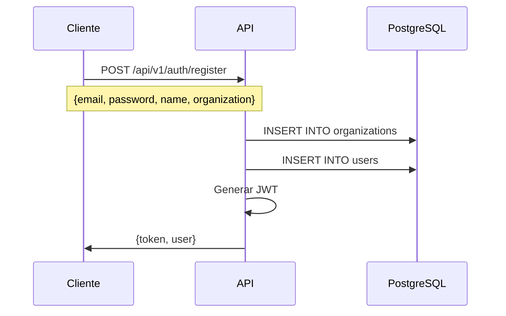
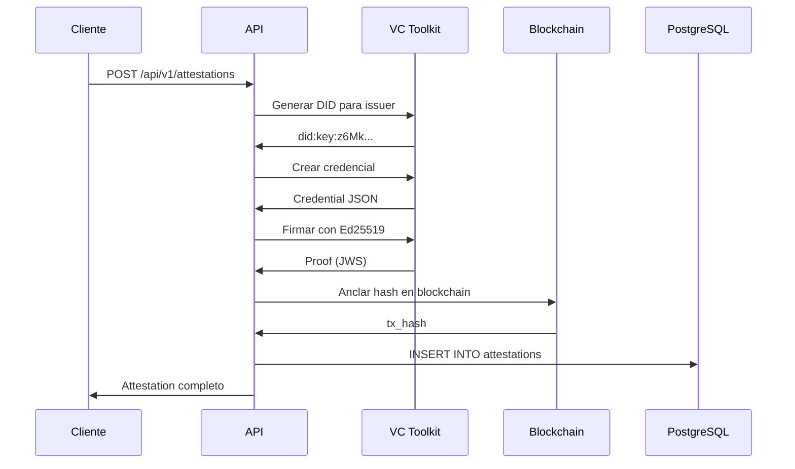
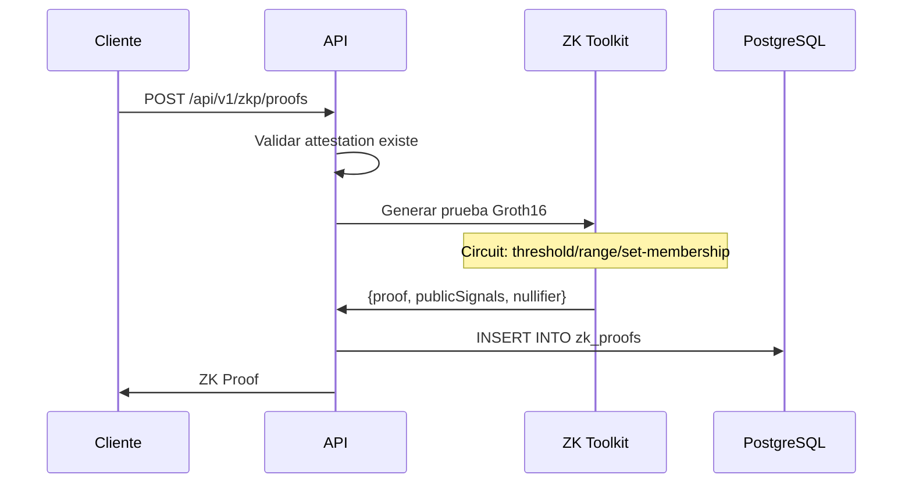

# ProofPass Platform - Flujo End-to-End Completo

Este documento describe el flujo completo de la plataforma desde el registro de un cliente hasta la verificación de credenciales y pruebas ZK.

## Arquitectura General

```
┌─────────────────────────────────────────────────────────────────────────┐
│                           CLIENTE (SDK/API)                              │
└─────────────────────────────────────────────────────────────────────────┘
                                    │
                                    ▼
┌─────────────────────────────────────────────────────────────────────────┐
│                              API (Fastify)                               │
│  ┌──────────┐  ┌──────────────┐  ┌─────────┐  ┌──────────────────────┐ │
│  │   Auth   │  │ Attestations │  │   ZKP   │  │     Passports        │ │
│  └──────────┘  └──────────────┘  └─────────┘  └──────────────────────┘ │
└─────────────────────────────────────────────────────────────────────────┘
         │                │               │                │
         ▼                ▼               ▼                ▼
┌────────────┐    ┌───────────────┐  ┌──────────┐   ┌─────────────────┐
│ PostgreSQL │    │  VC Toolkit   │  │ZK Toolkit│   │ Blockchain SDK  │
│   (Users,  │    │ (W3C VCs,DIDs)│  │(Groth16) │   │ (Stellar, etc)  │
│ Orgs, etc) │    └───────────────┘  └──────────┘   └─────────────────┘
└────────────┘
```

## Flujo Completo

### 1. Registro de Usuario/Organización



**Request:**
```json
POST /api/v1/auth/register
{
  "email": "user@company.com",
  "password": "SecurePassword123!",
  "name": "John Doe",
  "organization": "Acme Corp"
}
```

**Response:**
```json
{
  "token": "eyJhbGciOiJIUzI1NiIs...",
  "user": {
    "id": "uuid",
    "email": "user@company.com",
    "name": "John Doe",
    "organization_id": "uuid"
  }
}
```

### 2. Login

```json
POST /api/v1/auth/login
{
  "email": "user@company.com",
  "password": "SecurePassword123!"
}
```

### 3. Crear Attestation (Verifiable Credential)



**Request:**
```json
POST /api/v1/attestations
Authorization: Bearer <token>
{
  "subject": "product:organic-coffee-001",
  "type": "ProductCertification",
  "claims": {
    "productName": "Café Orgánico Premium",
    "certifications": ["USDA Organic", "Fair Trade"],
    "sustainabilityScore": 92,
    "origin": {
      "country": "Colombia",
      "region": "Huila"
    }
  },
  "blockchain_network": "stellar-testnet"
}
```

**Response:**
```json
{
  "id": "uuid",
  "credential": {
    "@context": ["https://www.w3.org/2018/credentials/v1"],
    "type": ["VerifiableCredential", "ProductCertification"],
    "issuer": "did:key:z6MkhaXgBZD...",
    "issuanceDate": "2024-12-02T...",
    "credentialSubject": {
      "id": "product:organic-coffee-001",
      "productName": "Café Orgánico Premium",
      ...
    },
    "proof": {
      "type": "Ed25519Signature2020",
      "created": "2024-12-02T...",
      "proofPurpose": "assertionMethod",
      "verificationMethod": "did:key:z6MkhaXgBZD...#key-1",
      "jws": "eyJhbGciOi..."
    }
  },
  "blockchain_tx_hash": "abc123...",
  "blockchain_network": "stellar-testnet"
}
```

### 4. Crear ZK Proof

El ZK Proof permite probar propiedades sin revelar valores exactos.



**Request:**
```json
POST /api/v1/zkp/proofs
Authorization: Bearer <token>
{
  "attestation_id": "uuid",
  "circuit_type": "threshold",
  "private_inputs": {
    "value": 92  // sustainabilityScore (secreto)
  },
  "public_inputs": {
    "threshold": 80  // Umbral público
  }
}
```

**Response:**
```json
{
  "id": "uuid",
  "attestation_id": "uuid",
  "circuit_type": "threshold",
  "proof_data": {
    "pi_a": ["...", "..."],
    "pi_b": [["...", "..."], ["...", "..."]],
    "pi_c": ["...", "..."],
    "protocol": "groth16"
  },
  "public_signals": ["1", "80"],
  "nullifier_hash": "0x1234...",
  "verified": true
}
```

**Tipos de Circuitos Disponibles:**

| Circuito | Descripción | Ejemplo |
|----------|-------------|---------|
| `threshold` | Probar que value >= threshold | Edad >= 18, Score >= 80 |
| `range` | Probar que min <= value <= max | 18 <= edad <= 65 |
| `set_membership` | Probar que value ∈ set | categoría ∈ {A,B,C} |

### 5. Verificar Attestation

**Endpoint público** (no requiere autenticación):

```json
POST /api/v1/attestations/{id}/verify

Response:
{
  "valid": true,
  "checks": {
    "signature": true,
    "expiration": true,
    "revocation": false,
    "blockchain": true
  },
  "blockchain_verification": {
    "network": "stellar-testnet",
    "tx_hash": "abc123...",
    "confirmed": true
  }
}
```

### 6. Verificar ZK Proof

**Endpoint público:**

```json
GET /api/v1/zkp/proofs/{id}/verify

Response:
{
  "valid": true,
  "circuit_type": "threshold",
  "claim": "value >= 80",
  "nullifier_hash": "0x1234...",
  "verified_at": "2024-12-02T..."
}
```

## Logging de Uso por Cliente

Cada request del SDK se registra automáticamente:

```sql
-- Tabla usage_logs
{
  "id": "uuid",
  "organization_id": "uuid",
  "user_id": "uuid",
  "api_key_id": "uuid",
  "endpoint": "/api/v1/attestations",
  "method": "POST",
  "status_code": 201,
  "response_time_ms": 156,
  "created_at": "2024-12-02T..."
}
```

### Obtener Uso

```json
GET /api/v1/usage/summary
Authorization: Bearer <token>

Response:
{
  "period": "2024-12",
  "total_requests": 1250,
  "attestations_created": 45,
  "zk_proofs_generated": 12,
  "verifications": 890,
  "quota": {
    "plan": "pro",
    "attestations_limit": 1000,
    "attestations_used": 45,
    "zk_proofs_limit": 100,
    "zk_proofs_used": 12
  }
}
```

## Uso del SDK

### Instalación

```bash
npm install @proofpass/sdk
```

### Ejemplo Completo

```typescript
import { ProofPassClient } from '@proofpass/sdk';

// 1. Inicializar cliente
const client = new ProofPassClient({
  apiUrl: 'http://localhost:3000',
  apiKey: 'your-api-key'
});

// 2. Crear attestation
const attestation = await client.attestations.create({
  type: 'ProductCertification',
  subject: { id: 'product:coffee-001' },
  claims: {
    productName: 'Café Orgánico',
    sustainabilityScore: 92
  }
});

console.log('Attestation ID:', attestation.id);

// 3. Generar ZK Proof
const zkProof = await client.zkp.generateThresholdProof({
  value: 92,
  threshold: 80
});

console.log('Proof válido:', zkProof.verified);
console.log('Nullifier:', zkProof.nullifierHash);

// 4. Verificar attestation
const verification = await client.attestations.verify(attestation.id);
console.log('Attestation válido:', verification.valid);

// 5. Verificar ZK proof
const zkValid = await client.zkp.verify(zkProof);
console.log('ZK Proof válido:', zkValid);
```

## Ejecutar Pruebas E2E

### Con Docker (recomendado)

```bash
# Levantar servicios y ejecutar tests
./scripts/start-and-test.sh

# Solo ver logs
./scripts/start-and-test.sh --logs

# Detener servicios
./scripts/start-and-test.sh --down
```

### Sin Docker (solo toolkits)

```bash
# Demo de credenciales y ZK proofs (sin API)
node scripts/demo-standalone.js

# Casos de uso específicos
node examples/use-cases/1-product-certification.js
node examples/use-cases/2-age-verification.js
node examples/use-cases/3-supply-chain.js
```

### Test E2E completo contra API

```bash
# Requiere que la API esté corriendo
node scripts/e2e-full-test.js

# Con verbose output
VERBOSE=true node scripts/e2e-full-test.js

# Contra API de producción
API_URL=https://api.proofpass.co node scripts/e2e-full-test.js
```

## Endpoints API Completos

### Autenticación
| Método | Endpoint | Descripción |
|--------|----------|-------------|
| POST | `/api/v1/auth/register` | Registrar usuario |
| POST | `/api/v1/auth/login` | Login |
| GET | `/api/v1/auth/me` | Usuario actual |

### Attestations
| Método | Endpoint | Descripción |
|--------|----------|-------------|
| POST | `/api/v1/attestations` | Crear attestation |
| GET | `/api/v1/attestations` | Listar attestations |
| GET | `/api/v1/attestations/:id` | Obtener attestation |
| POST | `/api/v1/attestations/:id/verify` | Verificar (público) |

### ZK Proofs
| Método | Endpoint | Descripción |
|--------|----------|-------------|
| POST | `/api/v1/zkp/proofs` | Generar ZK proof |
| GET | `/api/v1/zkp/proofs` | Listar proofs |
| GET | `/api/v1/zkp/proofs/:id` | Obtener proof |
| GET | `/api/v1/zkp/proofs/:id/verify` | Verificar (público) |

### Passports
| Método | Endpoint | Descripción |
|--------|----------|-------------|
| POST | `/api/v1/passports` | Crear passport |
| GET | `/api/v1/passports/:id` | Obtener passport |
| GET | `/api/v1/passports/:id/verify` | Verificar (público) |

### Usage
| Método | Endpoint | Descripción |
|--------|----------|-------------|
| GET | `/api/v1/usage/summary` | Resumen de uso |
| GET | `/api/v1/usage/logs` | Logs detallados |

### Health
| Método | Endpoint | Descripción |
|--------|----------|-------------|
| GET | `/health` | Health check básico |
| GET | `/ready` | Readiness (incluye DB) |
| GET | `/docs` | Swagger UI |

## Arquitectura de Seguridad

### Autenticación
- JWT tokens con expiración configurable
- API Keys para acceso programático
- Refresh tokens (opcional)

### Rate Limiting
| Endpoint Type | Límite |
|---------------|--------|
| Auth (login/register) | 5/15min |
| User endpoints | 60/min |
| ZKP (expensive) | 10/min |
| Verificación | Sin límite |

### Validación
- Input sanitization (XSS, SQL injection)
- Schema validation con Zod
- Content-Type enforcement
- Request size limits (1MB)

## Monitoreo

### Prometheus Metrics
- `http_requests_total` - Total de requests
- `http_request_duration_seconds` - Latencia
- `attestations_created_total` - Attestations creados
- `zk_proof_generation_duration_seconds` - Tiempo ZK

### Grafana Dashboards
- Service Health Overview
- Performance Metrics
- Business Metrics (attestations/hour)
- Resource Usage (CPU, Memory)

Ver `observability/` para configuraciones.
