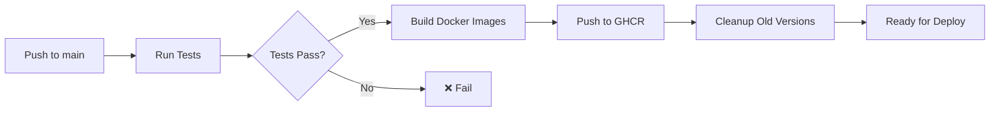

# Testing y Docker Setup - ProofPass Platform

Guía completa para hacer funcionar los tests y Docker en ProofPass Platform.

## ✅ Cambios Realizados

### 1. Configuración de Tests
- ✅ Agregados scripts de test al `apps/api/package.json`
- ✅ Configuración de jest ya existía y está correcta
- ✅ Tests listos para ejecutarse

### 2. Docker Configuration
- ✅ `docker-compose.yml` actualizado para usar el Dockerfile correcto de la raíz
- ✅ Agregado servicio de `platform` al docker-compose
- ✅ Creado `.env.docker` con configuración por defecto
- ✅ Dockerfiles revisados y funcionan correctamente

### 3. CI/CD Workflow
- ✅ Actualizado `.github/workflows/ci.yml`:
  - ✅ Ahora usa el Dockerfile correcto (raíz para API, apps/platform para Platform)
  - ✅ Agregado cleanup automático de imágenes antiguas (mantiene solo las últimas 2 versiones)
  - ✅ Soporte multi-plataforma (linux/amd64, linux/arm64)
  - ✅ Usa `actions/delete-package-versions@v5` para limpiar registry

### 4. Scripts de Utilidad
- ✅ `scripts/check-and-fix.sh` - Verifica y arregla el entorno
- ✅ `scripts/run-tests.sh` - Ejecuta tests fácilmente
- ✅ `scripts/docker-test.sh` - Construye y prueba Docker
- ✅ `scripts/README.md` - Documentación de scripts

## 🚀 Cómo Proceder

### Paso 1: Verificar Entorno

```bash
./scripts/check-and-fix.sh
```

Este script:
- Verifica Node.js, npm, Docker
- Instala dependencias si faltan
- Construye packages si es necesario
- Crea archivos de configuración

### Paso 2: Ejecutar Tests Localmente

```bash
# Todos los tests
./scripts/run-tests.sh all

# Solo API (necesita PostgreSQL y Redis)
./scripts/run-tests.sh api

# Solo Platform
./scripts/run-tests.sh platform
```

**Nota**: Los tests del API necesitan PostgreSQL y Redis. El script los levantará automáticamente con Docker si no están corriendo.

### Paso 3: Probar Docker Build

**Importante**: Asegúrate de que Docker Desktop esté corriendo.

```bash
# Construir ambas imágenes
./scripts/docker-test.sh all

# O solo una
./scripts/docker-test.sh api
./scripts/docker-test.sh platform
```

### Paso 4: Probar Docker Compose

```bash
# Levantar todo el stack
docker-compose up

# O en background
docker-compose up -d

# Ver logs
docker-compose logs -f

# Parar todo
docker-compose down
```

Servicios disponibles:
- **API**: http://localhost:3000
- **Platform**: http://localhost:3001
- **PostgreSQL**: localhost:5432
- **Redis**: localhost:6379

## 🐛 Troubleshooting

### Docker no está corriendo

```bash
# macOS
open -a Docker

# Linux
sudo systemctl start docker

# Verificar que está corriendo
docker ps
```

### Tests fallan por packages no compilados

```bash
# Construir packages manualmente
npm run build:packages

# O uno por uno
cd packages/types && npm run build
cd ../vc-toolkit && npm run build
cd ../blockchain && npm run build
# etc...
```

### PostgreSQL no se conecta

```bash
# Levantar solo PostgreSQL
docker-compose up -d postgres

# Verificar que está corriendo
docker-compose ps

# Ver logs
docker-compose logs postgres
```

### Build de Docker falla

```bash
# Limpiar Docker
docker system prune -a

# Intentar de nuevo
docker build -t proofpass-api:test .

# Ver logs detallados
docker build --progress=plain -t proofpass-api:test .
```

### Platform build falla (Next.js)

El Dockerfile de Platform usa `standalone` output. Asegúrate de que `next.config.js` tiene:

```js
module.exports = {
  output: 'standalone',
  // ...
}
```

## 📊 CI/CD en GitHub Actions

El workflow de CI/CD (`.github/workflows/ci.yml`) se ejecuta automáticamente en:
- Push a `main` o `develop`
- Pull requests a `main` o `develop`

**Stages**:
1. ✅ Test API Backend (con PostgreSQL y Redis)
2. ✅ Test Platform Dashboard
3. ✅ Security Audit (npm audit + Snyk)
4. ✅ Build Docker Images (solo en push a main)
5. ✅ Cleanup Old Images (mantiene 2 versiones)
6. ✅ Deploy (placeholder para AWS/etc)

### Limpieza Automática de Imágenes

El workflow ahora incluye:

```yaml
- name: Cleanup old API images
  uses: actions/delete-package-versions@v5
  with:
    package-name: 'proofpassplatform/api'
    package-type: 'container'
    min-versions-to-keep: 2
    ignore-versions: '^latest$'
```

Esto mantiene solo:
- La versión `latest`
- Las últimas 2 versiones etiquetadas con SHA

## 🎯 Testing Matrix

### Tests del API
- **Ubicación**: `apps/api/__tests__/`
- **Coverage**: 85%+ requerido
- **Necesita**: PostgreSQL, Redis
- **Tiempo**: ~30 segundos

### Tests del Platform
- **Ubicación**: `apps/platform/__tests__/`
- **Coverage**: No especificado aún
- **Necesita**: Solo Node.js
- **Tiempo**: ~10 segundos

### Tests de Packages
Cada package en `packages/` tiene sus propios tests:
- `vc-toolkit` - 60+ tests
- `zk-toolkit` - Tests de circuits
- `blockchain` - Tests de integración
- `client` - Tests del SDK
- etc.

## 📦 Docker Images

### API Image
- **Base**: node:20-alpine
- **Stages**: Builder (compila) → Runner (producción)
- **Tamaño**: ~300MB (aproximado)
- **Incluye**: API + todos los packages compilados

### Platform Image
- **Base**: node:20-alpine
- **Stages**: Deps → Builder → Runner
- **Tamaño**: ~200MB (aproximado)
- **Incluye**: Next.js standalone output

## 🔄 Flujo Completo de CI/CD



## 🚀 Deploy a AWS (Próximo Paso)

Una vez que Docker funcione localmente:

1. **Configurar AWS ECR** (Elastic Container Registry)
2. **Configurar ECS** (Elastic Container Service) o **App Runner**
3. **Agregar secretos a GitHub**:
   - `AWS_ACCESS_KEY_ID`
   - `AWS_SECRET_ACCESS_KEY`
   - `AWS_REGION`
4. **Actualizar workflow** para push a ECR y deploy a ECS

Ver `scripts/deploy-aws.sh` para ejemplo de deploy.

## ✅ Checklist Final

Antes de deploy a AWS:

- [ ] Tests pasan localmente
- [ ] Docker build funciona localmente
- [ ] docker-compose funciona localmente
- [ ] CI/CD pasa en GitHub Actions
- [ ] Imágenes se limpian correctamente en registry
- [ ] Variables de entorno configuradas
- [ ] Secretos configurados en GitHub
- [ ] AWS infrastructure lista

## 📚 Documentación Adicional

- [Getting Started](docs/GETTING_STARTED.md)
- [Deployment Guide](docs/DEPLOYMENT.md)
- [Testing Guide](docs/testing/MAINTAINABLE_TESTS.md)
- [Scripts README](scripts/README.md)
- [CI/CD Workflow](.github/workflows/ci.yml)

## 🤝 Soporte

Si tienes problemas:
1. Verifica que Docker esté corriendo
2. Ejecuta `./scripts/check-and-fix.sh`
3. Revisa los logs: `docker-compose logs`
4. Abre un issue en GitHub

---

**¡Todo listo para testing y Docker!** 🎉

Ejecuta `./scripts/check-and-fix.sh` para empezar.
